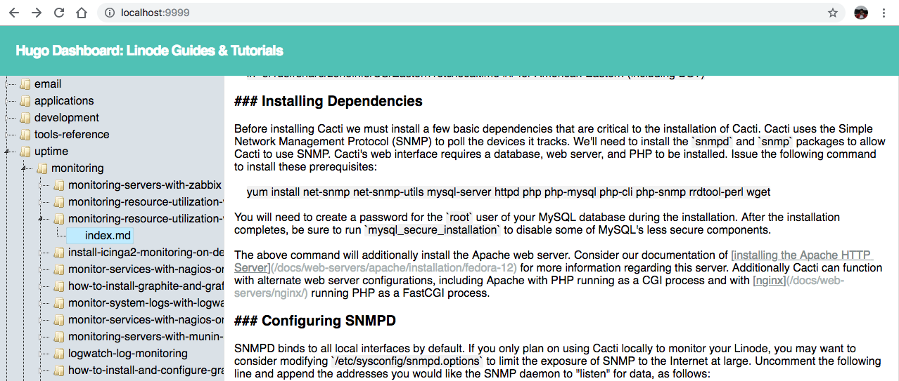

# Hugo Dashboard
a tiny UI dashboard for managing [Hugo](https://gohugo.io) websites written in Go




# Installation
## Build from Source
```
> go build

> ./hugo-dashboard --path /Users/ash/tmp/linode-docs --content-dir docs
```

**NOTE:** you need to define `--content-dir` if the content directory of your hugo website is not **content**


... under construction

# This project is not ready for production use yet